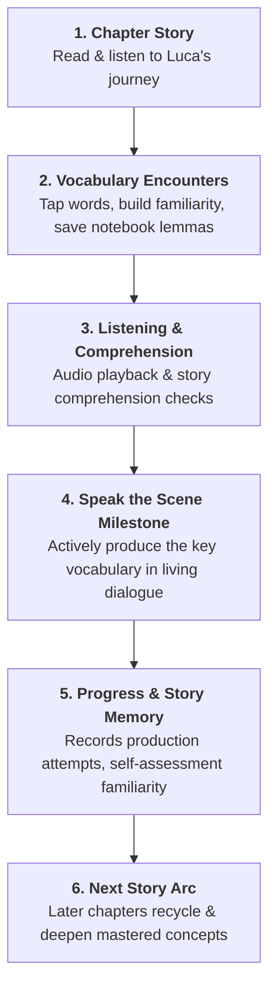

# Speak Scene Authoring Standard & Invariants

## 1. The Core Product Invariant
> [!IMPORTANT]
> **ENFORCEABLE PRODUCT INVARIANT**:
> **The learner's response must communicate something meaningful, and the subsequent dialogue must acknowledge that communication.**
>
> A scene **fails review** if it performs a generic prompt-response drill:
> $$\text{Partner} \longrightarrow \text{Learner Answer} \longrightarrow \text{Generic Next Question (Rejected)}$$
>
> A scene **passes review** only when it creates a living conversational reaction:
> $$\text{Partner} \longrightarrow \text{Learner Decision / Action} \longrightarrow \text{Partner Reacts Directly to That Choice} \longrightarrow \text{New Situation (Approved)}$$

---

## 2. The End-to-End Storibase Learning Loop

Speak the Scene is not an isolated minigame—it is the **production culmination** of the narrative learning loop:

---

## 3. The 7-Milestone Luca Character Arc

Luca's language growth mirrors his emotional and personal maturation in Rome:

| Batch | Milestone Theme | Key Narrative Goal | Core Recycled Vocabulary |
|---|---|---|---|
| **15** | **Help Someone** | Luca steps up to solve Marco's crisis | `aiutare`, `biglietto`, `problema`, `costare`, `insieme` |
| **20** | **Reconnect with Friends** | Celebrating reunion and claiming Rome as home | `tornare`, `insieme`, `caffè`, `lavoro`, `casa`, `felice` |
| **24** | **Reassure Family** | Giving Mom peace of mind about his independence | `stare bene`, `casa`, `lavoro`, `amici`, `volere bene` |
| **27** | **Confront Uncertainty** | Addressing fear of eviction/job loss with action | `pensare`, `affitto`, `paura`, `piano`, `Nonna Rosa` |
| **30** | **Propose a Plan** | Pitching a neighborhood gathering to skeptical owner | `idea`, `festa`, `quartiere`, `costare poco`, `pronti` |
| **35** | **Coordinate People** | Delegating café roles and building community | `aspettare`, `Nonna Rosa`, `caffè`, `quartiere`, `tornare` |
| **40** | **Negotiate Your Future** | Choosing independent life in Rome over safe retreat | `tempo libero`, `orario`, `dire no`, `restare a Roma`, `casa` |

---

## 4. The 5 Essential Authoring Questions

Every single turn must answer:
1. **What does the conversation partner say?**
2. **What must the learner communicate?**
3. **What is the communicative intent?** (`offer_help`, `propose`, `ask_for_information`, `agree`, `explain_problem`, `express_feeling`, etc.)
4. **What Italian does the learner need?** (Target Italian + rich acceptable communicative variants)
5. **What happens because they said it?** (The character reacts directly to the learner's communication rather than advancing on rails)

---

## 5. Pedagogical Scaffolding Hierarchy
- **Level 1 (Keywords)**: Lexical recall anchors without revealing full syntax.
- **Level 2 (Scaffold Frame)**: Structural cloze frame reducing cognitive load.
- **Level 3 (Model Target + Audio)**: Complete model Italian with **🔊 Listen & Repeat** audio practice.
- **Tap to Translate ▾**: Kept hidden by default to prioritize Italian immersion.
