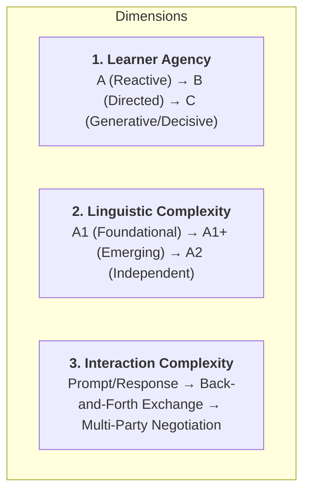

# Speak the Scene V2: Catalog Progression & Quality Audit

## 1. The Three Dimensions of Conversational Growth

To evaluate whether each Speak the Scene milestone is pedagogically rigorous and engaging, every scene is audited across three distinct, orthogonal dimensions:

### Dimension 1: Learner Agency (Control of Narrative Direction)
- **Level A — Reactive**: Answering a direct query or answering when called upon (e.g. *«Bene, grazie. Sto bene a Roma.»*).
- **Level B — Directed**: Selecting, framing, and asserting Italian to meet an emotional or situational objective (e.g. *«Possiamo aiutare Marco.»*, *«Non sono solo, ho amici come Sofia e Giulia.»*).
- **Level C — Generative / Negotiating / Decisive**: Proposing strategies, troubleshooting dilemmas, negotiating terms, pitching ideas, and making life decisions that determine what happens next (e.g. *«Abbiamo un'idea: una festa piccola per il quartiere.»*, *«Accetto le ore, ma voglio tempo libero la sera.»*).

### Dimension 2: Linguistic Complexity (Target Italian & Production Demand)
- **A1**: Present tense regular/irregular high-frequency verbs (*stare*, *avere*, *essere*, *andare*, *volere*, *potere*), basic nouns, greetings, and polarity.
- **A1+**: Direct objects, compound clauses, prepositions of place/time (*all'affitto*, *al caffè*, *da Nonna Rosa*, *nel quartiere*), sequencing (*prima*, *adesso*, *dopo*), and negation.
- **A2**: Negotiation frames, compound tenses (*passato prossimo*), time conditions, boundary setting, and self-determining declarations (*«Per adesso resto a Roma... questa è casa»*).

### Dimension 3: Interaction Complexity (Social & Conversational Dynamics)
- **Controlled Exchange**: 1-on-1 supportive exchange (e.g., checking in with a close friend or parent).
- **Collaborative Problem-Solving**: 1-on-1 brainstorming or strategic planning (e.g., Luca & Sofia planning around rent and the café).
- **High-Stakes Multi-Party Negotiation**: Persuading skeptical authorities, managing a bustling public space, or coordinating multi-character roles under pressure (e.g., Luca pitching the owner, welcoming Nonna Rosa & neighbors).

---

## 2. Milestone Scene Audit Table

| Scene ID | Batch | Title | Linguistic Level | Agency Level | Interaction Complexity | Narrative Conflict & Communicative Goal |
|---|---|---|---|---|---|---|
| `speak-15` | 15 | **Help Marco** | **A1** | **Agency B** (25% C) | Collaborative Action | Marco has no money for a train ticket $\to$ Luca steps up and proposes buying it. |
| `speak-20` | 20 | **Back in Rome** | **A1** | **Agency B** (25% C) | Friendly Reunion Exchange | Trip concludes $\to$ Luca invites friends for coffee and acknowledges Rome as home. |
| `speak-24` | 24 | **Sunday Call** | **A1+** | **Agency B** (100% B) | Emotional Family Exchange | Mother's long-distance anxiety $\to$ Luca provides comforting, mature reassurance about his housing, job, and friendships. |
| `speak-27` | 27 | **Sofia’s Opinion** | **A1+** | **Agency C** (60% C) | Strategic Crisis Planning | Café closure rumors $\to$ Luca and Sofia confront anxiety and agree to seek Nonna Rosa's guidance. |
| `speak-30` | 30 | **A Small Plan** | **A1+** | **Agency C** (80% C) | High-Stakes Negotiation | Skeptical café owner $\to$ Luca pitches a low-cost Saturday party and negotiates a trial event. |
| `speak-35` | 35 | **The Cafe Fills Up** | **A1+** | **Agency C** (67% C) | Multi-Character Coordination | Quiet café suddenly swarmed $\to$ Luca organizes bar roles, welcomes neighbors, and invites recurring visits. |
| `speak-40` | 40 | **Luca Chooses Rome** | **A2** | **Agency C** (80% C) | Autonomous Life Decision | Owner offers more hours + Mother offers hometown job $\to$ Luca negotiates his schedule and commits to his independent future in Rome. |

---

## 3. Production QA Checklist

### 1. Conversation & Continuity
- [x] Every partner line responds directly to the communicative outcome of the preceding turn.
- [x] Tone is warm, natural, and character-authentic (Sofia is practical & encouraging; Padrone is gruff but fair; Mamma is caring & anxious; Nonna Rosa is energetic).
- [x] Clear visual distinction between Partner (left, avatar, name) and Learner (right, highlight, role).

### 2. Audio & Speech Input
- [x] Partner audio button supports instant playback with stop-on-unmount.
- [x] Speech recognition populates the unified text input directly, allowing instant touch-editing of transcript before submission.
- [x] Speech error states guide the learner gently without clearing conversational context.

### 3. Pedagogical Scaffolding
- [x] **Level 1 (Keywords)**: Provides lexical recall anchors without revealing full grammar.
- [x] **Level 2 (Scaffold Frame)**: Provides a structural cloze frame to reduce syntactic load.
- [x] **Level 3 (Model Target + Audio)**: Provides full target Italian with **🔊 Listen & Repeat** audio button for speaking practice.
- [x] **Tap to Translate ▾**: Kept hidden in an accordion drawer to preserve Italian immersion.

### 4. Mobile Ergonomics & Viewport Safety
- [x] KeyboardAvoidingView with smooth scroll-to-end on keyboard focus and stage changes.
- [x] Touch targets exceed 48dp minimum for all buttons (voice mic, submit, translate, audio, hints, vote buttons).
- [x] ScreenContent max-width constraint ensures cozy messaging aesthetics on tablets/large phones.
